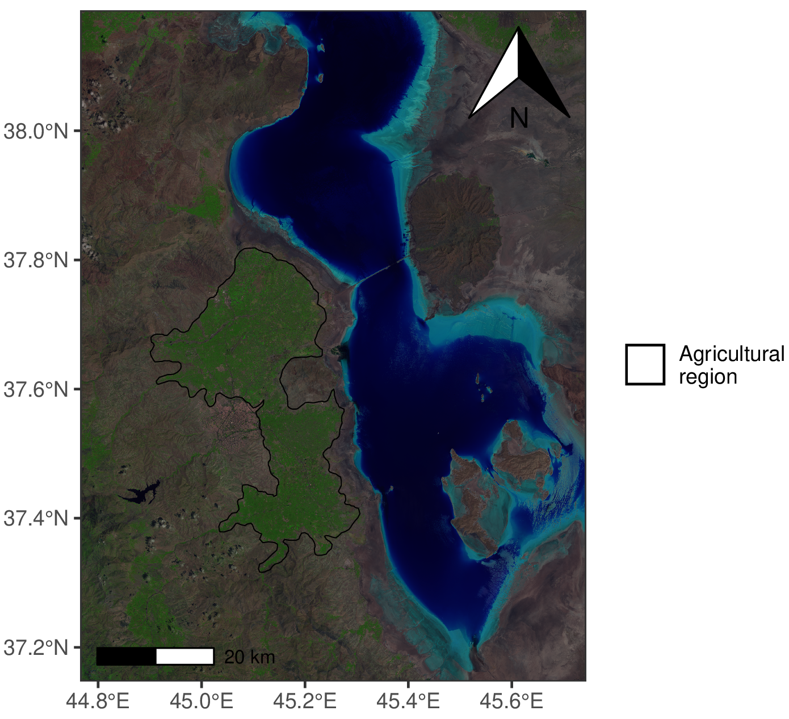
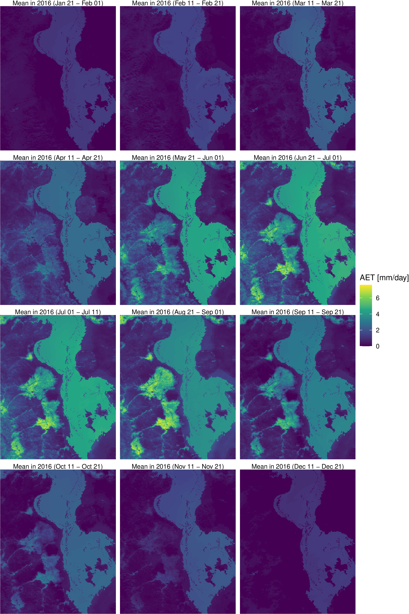
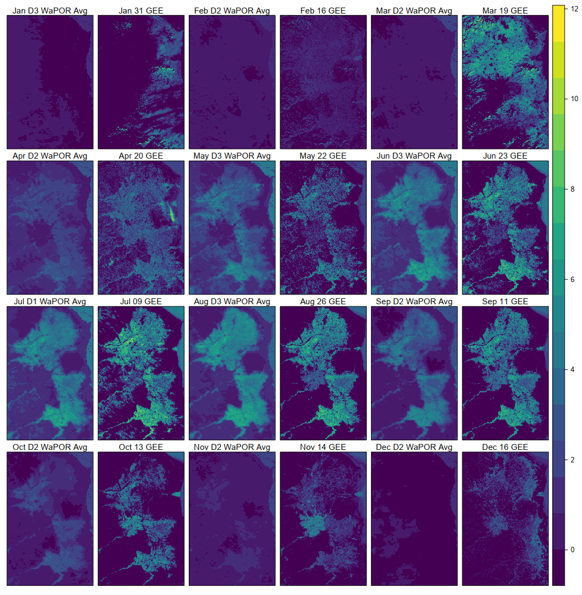
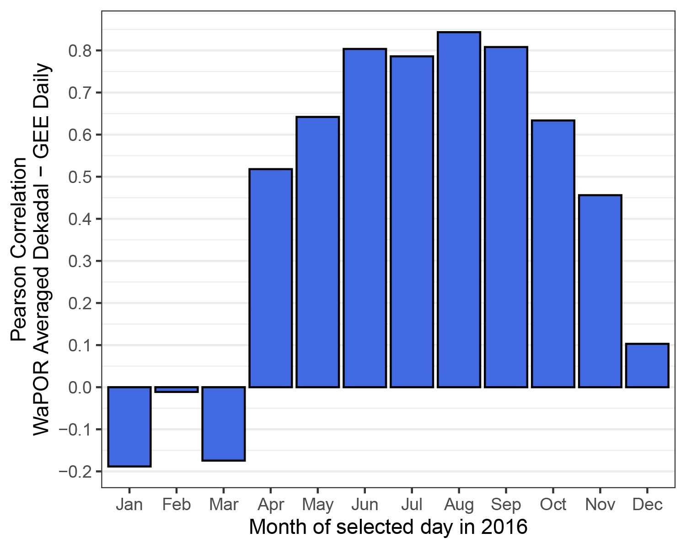
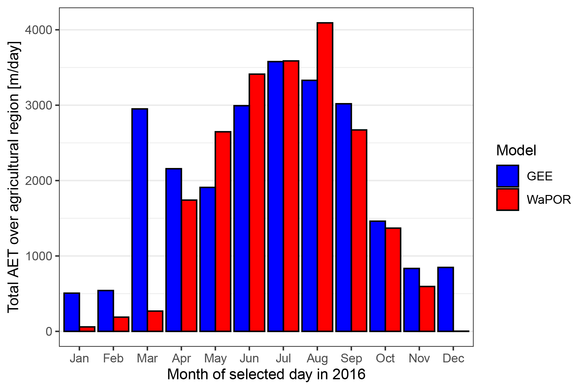

# Google Earth Engine AET (actual evapotranspiration) Model 

This repository offers useful functions located in the `model_partial` folder, which was developed as part of the AET model. These functions facilitate the calculation of various climatic variables and indices, specifically designed for use with Landsat 8 imagery. The list of supported variables and indices is provided below.  

1. Short-Wave Radiation
2. Long-Wave Radiation
3. Soil Heat Flux
4. Surface Albedo
5. Vegetation Indices (LAI, SAVI, NDVI)
6. Land Surface Temperature
7. Aerodynamic Stability Parameters

For detailed information regarding the METRIC (Mapping Evapotranspiration with Internalized Calibration) algorithm, you can visit: [Allen et al. (2007)](https://www.researchgate.net/publication/228615269_Satellite-Based_Energy_Balance_for_Mapping_Evapotranspiration_With_Internalized_Calibration_METRIC_-_Model#full-text) 

Due to the prolonged drought situation in Urmia Lake over the past several years, the effectiveness of this model (GEE) has been assessed in an agricultural region near Urmia Lake (see Figures 1 & 2). The evaluation involved testing the model for one day from each month of 2016 and comparing the results with those from [WaPOR](https://wapor.apps.fao.org/home/WAPOR_2/1), developed by FAO. The comparison specifically focused on the 250-meter resolution Dekadal (10-days) average estimates provided by WaPOR. The superior resolution of the GEE model at 30 meters, coupled with its efficiency in delivering results for any time and region within seconds on Google Earth Engine, highlights a significant opportunity for obtaining high-resolution data. This capability is particularly valuable in the context of agricultural water management and decision-making processes. The developed GEE model also has shown 80 times less clock time in comparison with a similar model developed in MATLAB.

A summary of the results for 2016 is presented below, and R scripts in the `scripts` folder have been used for this purpose. Figure 1 shows the study region on which the model has been tested. 

{width=75%}
Figure 1. Agricultural band combination (6, 5, 4) of Landsat 8 on July 09 2016 over Urmia Lake.

Figure 2. Agricultural region located near Urmia Lake.

Following the execution of the GEE model for the chosen date of each month in 2016 (selected based on the smallest cloud cover), the results are depicted in Figure 3. WAPOR data was specifically chosen to provide the average Dekadal mean daily AET over the relevant period, which includes the selected date. WaPOR spatial maps can also be seen in Figure 4.

Figure 3. GEE model results in selected dates in 2016 over the study region.

Figure 4. WaPOR results covering 10-day periods in selected dates in 2016 over the study region.

As illustrated in Figure 5, the dominance of the vertical hydrological flux increases during growing seasons (May to September) due to the rise in net radiation flux. This leads to greater consistency between GEE results and WaPOR estimates. This observed pattern is further emphasized by a higher correlation, as depicted in Figure 6, and a notable similarity in cumulative AET over the agricultural region between GEE results and WaPOR estimates in these months. Therefore, it can be concluded that the bias in the developed models is minimal, indicating their robust performance during the agricultural season. This performance makes them a valuable tool for water resource management and stakeholders involved in the process.

Figure 5. Comparison of GEE and WaPOR AET [mm/day] for selected dates. D1, D2, and D3 represent the first, and second 10 days and remaining days of the month.

{width = 50%}
Figure 6. Pearson correlation between GEE and WaPOR AET spatial maps on selected dates of each month.

{width = 50%}
Figure 6. The sum of AET over the agricultural region: calculated with each GEE and WaPOR for each selected date.
